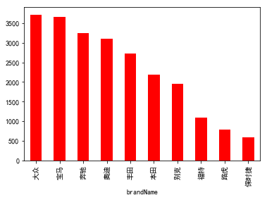
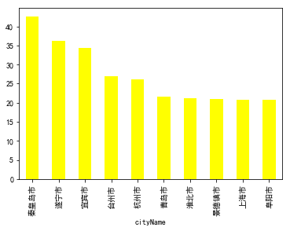

```python
%matplotlib inline
import pandas as pd
import matplotlib as mpl
mpl.rcParams['font.sans-serif'] = ['SimHei'] #汉字字体设置
```


```python
data = pd.read_csv('beitai.csv',encoding='utf8')
df =data
df.drop('price',axis=1)
df['lowPrice'] =[i[0]  for i in data.price.str[:-2].str.split('~')]
df['highPrice'] =[i[1]  for i in data.price.str[:-2].str.split('~')]
car_brand  = .brandName.count().sort_values(ascending=False)[:10]
car_brand.plot(kind='bar',color='r')   # 前10个品牌
```


    <matplotlib.axes._subplots.AxesSubplot at 0x2289977a588>





```python
brand_price =df.groupby(by='brandName').meanPrice.mean().sort_values(ascending=False) #各汽车品牌均价
brand_price[:20]
```


    brandName
    劳斯莱斯      222.857963
    法拉利       152.308519
    宾利        133.954552
    兰博基尼       98.992424
    阿斯顿·马丁     97.906875
    劳伦士        53.570000
    玛莎拉蒂       50.077586
    巴博斯        47.017143
    保时捷        38.259399
    路虎         34.072465
    GMC        27.559750
    捷豹         27.138095
    奔驰         23.367864
    悍马         23.162500
    林肯         22.509737
    路特斯        22.000000
    宝马         18.945754
    雷克萨斯       18.685413
    英菲尼迪       18.613185
    奥迪         16.153260
    Name: meanPrice, dtype: float64


```python
brand_price.mean() #所有汽车的平均价格

```


    14.890942899805516


```python
df['meanPrice'] =1/2 *(df['lowPrice'].astype('float') +df['highPrice'].astype('float'))
city_meanprice=df.groupby(by='cityName').meanPrice.mean().sort_values(ascending=False)
city_meanprice[:10].plot(kind='bar',color='yellow')   #平均卖车 价格最高的10个城市
```


    <matplotlib.axes._subplots.AxesSubplot at 0x228995b6908>





```python

cumsum_city = city.cumsum()/len(df)
cumsum_city[:10]
#可以看到 前10名城市占据了42%  相比瓜子二手车 更集中
```


    cityName
    北京市     0.089920
    上海市     0.155643
    宁波市     0.200539
    成都市     0.234973
    大连市     0.267963
    东莞市     0.300632
    杭州市     0.331279
    西安市     0.361798
    郑州市     0.390905
    石家庄市    0.418825
    Name: brandName, dtype: float64


```python

```
